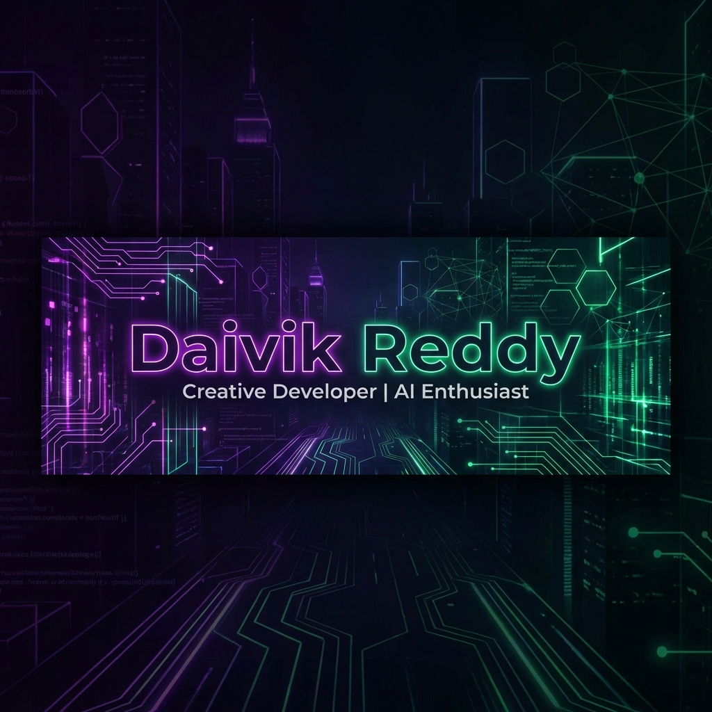

<div align="center">
  

  # Daivik Reddy
  ### Creative Developer | AI Enthusiast | Frontend Specialist

  <p>
    <a href="https://nextjs.org/">
      
    </a>
    <a href="https://www.typescriptlang.org/">
      
    </a>
    <a href="https://tailwindcss.com/">
      
    </a>
    <a href="https://framer.com/motion">
      
    </a>
    <a href="https://gsap.com/">
      
    </a>
  </p>

  <p>
    A personal portfolio website built with modern web technologies, featuring smooth page transitions, scroll-driven animations, and a warm gold design language.
  </p>
</div>

---

## 🌟 Key Features

- **🎨 Gold & Black Design System** — Warm `#FFD177` palette with custom Manuka & Faktum typography, fluid sizing, and elegant hover interactions.
- **✨ Page Transitions** — Smooth Framer Motion animations between routes for a premium navigation feel.
- **⚡ High Performance** — Optimized with Next.js 16 App Router for fast loads.
- **📱 Fully Responsive** — Seamless experience across all devices, from ultra-wide monitors to mobile phones.
- **🎬 Scroll Animations** — Word-split reveals, staggered card entrances, and animated dividers powered by IntersectionObserver.
- **🎵 Music Carousel** — Swiper-based horizontal scroll with vinyl-spin hover effects.
- **🎮 Games & Shows** — Curated grids showcasing favorite media with poster art and reviews.
- **❓ Q&A Section** — Personal FAQ with giant sticky wordmark.
- **🚫 Custom 404 Page** — Animated dark-themed error page with navigation back to the site.

---

## 🛠️ Tech Stack

- **Framework:** [Next.js 16](https://nextjs.org/) (App Router)
- **Language:** [TypeScript](https://www.typescriptlang.org/)
- **Styling:** [Tailwind CSS v4](https://tailwindcss.com/) + Vanilla CSS
- **Animations:** [Framer Motion](https://www.framer.com/motion/) + [GSAP](https://gsap.com/)
- **Carousel:** [Swiper](https://swiperjs.com/)
- **Smooth Scroll:** [Lenis](https://github.com/studio-freight/lenis)
- **Deployment:** Vercel / Netlify

---

## 📂 Project Structure

```
├── app/
│   ├── page.tsx             # Home — Hero, Bio, Shows, Music, Games, Q&A
│   ├── projects/page.tsx    # Projects — Featured + categorized GitHub repos
│   ├── list/page.tsx        # List — Films & series (dark theme)
│   ├── not-found.tsx        # Custom 404 page
│   ├── layout.tsx           # Root layout with page transitions
│   └── globals.css          # Full design system (~1200 lines)
├── components/
│   ├── Hero.tsx             # Full-viewport hero with name + clock
│   ├── PageTransition.tsx   # Framer Motion route transition wrapper
│   ├── TransitionProvider.tsx # AnimatePresence layout wrapper
│   ├── MusicSection.tsx     # Swiper carousel with vinyl art
│   ├── ShowsSection.tsx     # Poster grid with reviews
│   ├── GamesSection.tsx     # Game cover grid
│   ├── QASection.tsx        # Q&A with giant wordmark
│   ├── NavMenu.tsx          # Floating expandable pill nav
│   ├── FooterMinimal.tsx    # Giant wordmark footer + socials
│   ├── EmailFab.tsx         # Floating email copy button
│   └── ...
├── public/
│   ├── assets/              # Banner image
│   └── fonts/               # Custom Manuka & Faktum fonts
└── virtual-mouse/           # Standalone Python gesture control project
```

---

## 🚀 Getting Started

1. **Clone the repository:**
   ```bash
   git clone https://github.com/Daivik1520/profile.git
   cd profile
   ```

2. **Install dependencies:**
   ```bash
   npm install
   ```

3. **Run the development server:**
   ```bash
   npm run dev
   ```

4. **Open in browser:**
   Visit [http://localhost:3000](http://localhost:3000)

---

## 📬 Contact

**Daivik Reddy**  
Creative Developer | AI Enthusiast

[LinkedIn](https://www.linkedin.com/in/daivik-reddy-60a876311/) • [GitHub](https://github.com/Daivik1520) • [Instagram](https://instagram.com/daivik.exe) • [Email](mailto:daivik1520@gmail.com)

---

<div align="center">
  <i>Made with ❤️ using Next.js</i>
</div>
